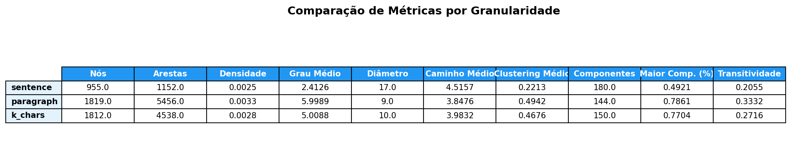
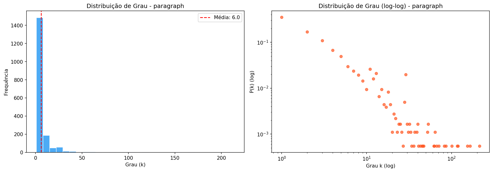
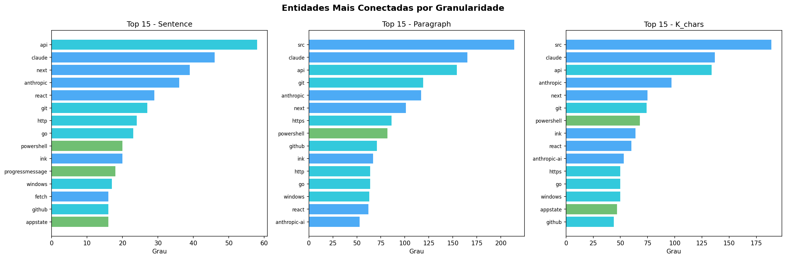
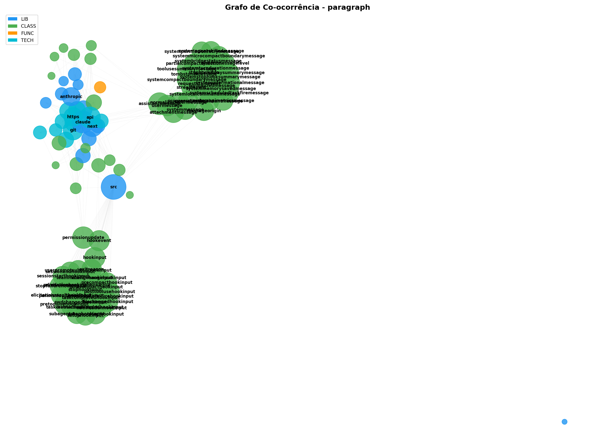

# Relatório de Extração e Análise — claude-code (restored-src)

## Repositório analisado

- **Fonte:** `data/raw/claude-code-sourcemap/restored-src/`
- **Descrição:** Código-fonte TypeScript do Claude Code (CLI da Anthropic),
  reconstruído a partir de source maps.

## Estatísticas da extração

| Métrica                  | Valor      |
| ------------------------ | ---------- |
| Arquivos TypeScript      | 1.888      |
| Arquivos de documentação | 0          |
| Total de blocos de texto | 78.526     |
| Total de caracteres      | 18.348.792 |

### Distribuição por tipo de bloco

| Tipo        | Quantidade | Descrição                           |
| ----------- | ---------- | ----------------------------------- |
| `import`    | 16.035     | Imports de módulos e pacotes        |
| `comment`   | 43.880     | Comentários de linha (`//`)         |
| `code`      | 10.550     | Classes, interfaces, funções, enums |
| `docstring` | 8.061      | Blocos JSDoc / `/* */`              |

## Métricas dos grafos de co-ocorrência

NER executado com regex + dicionários (sem spaCy).

### Métricas gerais

| Métrica                | Sentença | Parágrafo | K-chars (500) |
| ---------------------- | -------- | --------- | ------------- |
| Nós                    | 955      | 1.819     | 1.812         |
| Arestas                | 1.152    | 5.456     | 4.538         |
| Densidade              | 0,0025   | 0,0033    | 0,0028        |
| Grau médio             | 2,41     | 6,00      | 5,01          |
| Grau máximo            | 58       | 214       | 189           |
| Componentes conectados | 180      | 144       | 150           |
| Maior componente (%)   | 49,2%    | 78,6%     | 77,0%         |
| Diâmetro               | 17       | 9         | 10            |
| Caminho médio          | 4,52     | 3,85      | 3,98          |
| Clustering médio       | 0,2213   | 0,4942    | 0,4676        |
| Transitividade         | 0,2055   | 0,3332    | 0,2716        |

### Top 10 entidades por grau (parágrafo)

| Entidade   | Tipo  | Grau |
| ---------- | ----- | ---- |
| src        | LIB   | 214  |
| claude     | LIB   | 165  |
| api        | TECH  | 154  |
| git        | TECH  | 119  |
| anthropic  | LIB   | 117  |
| next       | LIB   | 101  |
| https      | TECH  | 86   |
| powershell | CLASS | 82   |
| github     | TECH  | 71   |
| ink        | LIB   | 67   |

## Figuras geradas

| Arquivo                             | Conteúdo                           |
| ----------------------------------- | ---------------------------------- |
| `figures/degree_dist_sentence.png`  | Distribuição de grau — sentença    |
| `figures/degree_dist_paragraph.png` | Distribuição de grau — parágrafo   |
| `figures/degree_dist_k_chars.png`   | Distribuição de grau — k-chars     |
| `figures/graph_viz_sentence.png`    | Grafo — sentença (layout de força) |
| `figures/graph_viz_paragraph.png`   | Grafo — parágrafo                  |
| `figures/graph_viz_k_chars.png`     | Grafo — k-chars                    |
| `figures/comparison_table.png`      | Tabela comparativa de métricas     |
| `figures/centrality_comparison.png` | Top entidades por centralidade     |

## Análise e insights

### 1. Estrutura geral

A codebase do Claude Code é altamente modular (16k imports, 1.888 arquivos TS).
O volume de comentários (56% dos blocos) indica boa documentação inline — fonte
rica para NER de linguagem natural quando spaCy for adicionado.

### 2. Comparação entre granularidades

- **Sentença** produz o grafo mais esparso (densidade 0,0025, grau médio 2,4).
  Apenas 49% dos nós estão no maior componente, com diâmetro alto (17),
  indicando muitos clusters isolados.
- **Parágrafo** gera o grafo mais denso (5.456 arestas, grau médio 6,0).
  79% dos nós no maior componente, diâmetro menor (9), clustering alto (0,49).
  Melhor para capturar relações semânticas entre entidades.
- **K-chars (500)** fica entre os dois — mesma quantidade de nós que parágrafo
  mas com menos arestas, sugerindo que a janela fixa perde co-ocorrências
  de longa distância que o parágrafo natural captura.

### 3. Entidades centrais

- **`src`** aparece como nó mais conectado (grau 214) por ser parte dos
  caminhos de import (`../src/...`) — pode ser filtrado como ruído.
- **`claude`** e **`anthropic`** são os hubs reais da rede, conectando
  módulos de API, autenticação, e ferramentas.
- **`api`**, **`git`**, **`github`** refletem as tecnologias centrais do
  projeto (API da Anthropic, operações git).
- **`ink`** e **`react`** indicam a stack de UI (Ink é o framework React
  para CLIs que o Claude Code usa).

### 4. Propriedades de rede

- O clustering médio alto (0,49 em parágrafo) indica forte agrupamento
  local — entidades que co-ocorrem tendem a formar triângulos, refletindo
  módulos coesos.
- A transitividade (0,33 em parágrafo) sugere estrutura de comunidades
  — provável que Louvain revele clusters temáticos (tools, UI, API, auth).

### 5. Problemas identificados

- `src` como LIB é falso positivo — path fragment, não biblioteca.
- `powershell` classificado como CLASS (por ser CamelCase) — deveria ser TECH.
- `next` como LIB pode ser ambíguo (Next.js vs palavra "next").

### 6. Próximos passos

- Filtrar ruído: remover `src`, caminhos relativos, e palavras comuns dos nós.
- Rodar com spaCy (`en_core_web_lg`) para entidades de linguagem natural.
- Detecção de comunidades (Louvain) para identificar clusters temáticos.
- Visualização interativa com pyvis.
