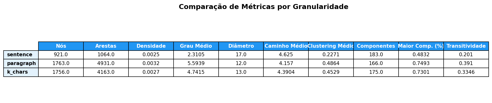
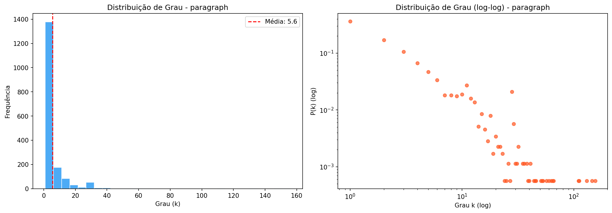
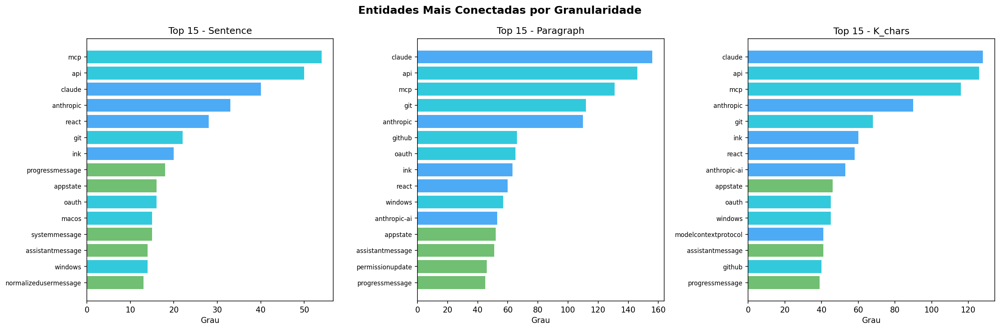
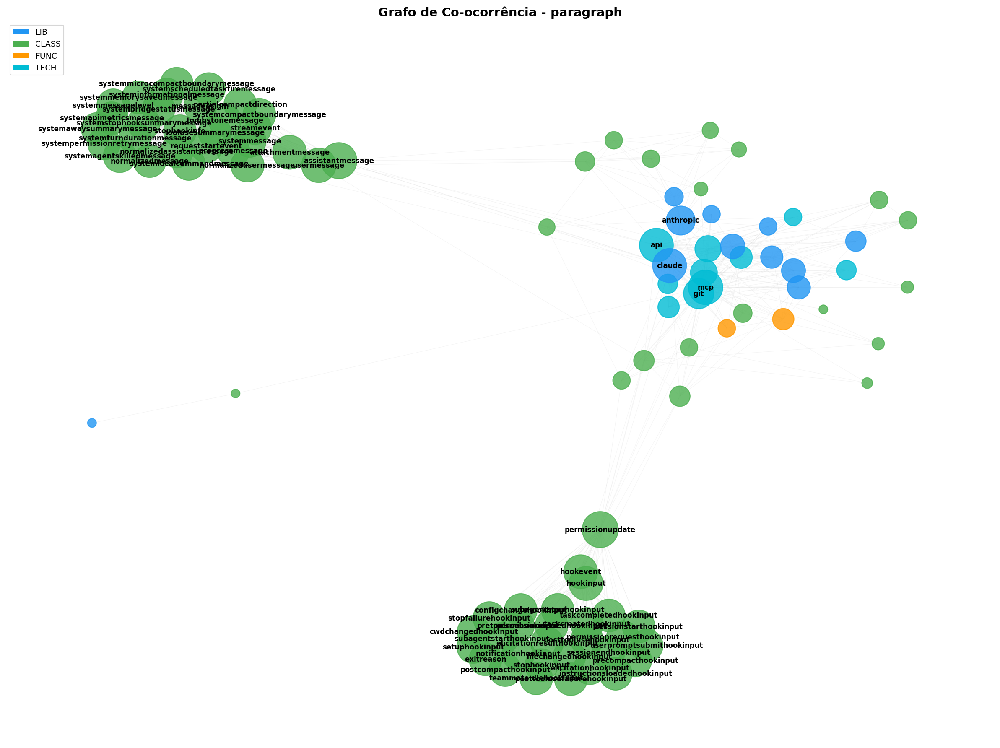

# Relatório de Extração e Análise — claude-code (restored-src)

## Repositório analisado

- **Fonte:** `data/raw/claude-code-sourcemap/restored-src/`
- **Descrição:** Código-fonte TypeScript do Claude Code (CLI da Anthropic),
  reconstruído a partir de source maps.

## Estatísticas da extração

| Métrica                  | Valor      |
| ------------------------ | ---------- |
| Arquivos TypeScript      | 1.888      |
| Arquivos de documentação | 0          |
| Total de blocos de texto | 78.526     |
| Total de caracteres      | 18.348.792 |

### Distribuição por tipo de bloco

| Tipo        | Quantidade | Descrição                           |
| ----------- | ---------- | ----------------------------------- |
| `import`    | 16.035     | Imports de módulos e pacotes        |
| `comment`   | 43.880     | Comentários de linha (`//`)         |
| `code`      | 10.550     | Classes, interfaces, funções, enums |
| `docstring` | 8.061      | Blocos JSDoc / `/* */`              |

## Métricas dos grafos de co-ocorrência

NER executado com regex + dicionários (sem spaCy), com filtragem de ruído
(stopwords para path fragments, protocolos genéricos e palavras ambíguas).

### Métricas gerais

| Métrica                | Sentença | Parágrafo | K-chars (500) |
| ---------------------- | -------- | --------- | ------------- |
| Nós                    | 921      | 1.763     | 1.756         |
| Arestas                | 1.064    | 4.931     | 4.163         |
| Densidade              | 0,0025   | 0,0032    | 0,0027        |
| Grau médio             | 2,31     | 5,59      | 4,74          |
| Grau máximo            | 54       | 156       | 128           |
| Componentes conectados | 183      | 166       | 175           |
| Maior componente (%)   | 48,3%    | 74,9%     | 73,0%         |
| Diâmetro               | 17       | 12        | 13            |
| Caminho médio          | 4,63     | 4,16      | 4,39          |
| Clustering médio       | 0,2271   | 0,4864    | 0,4529        |
| Transitividade         | 0,2010   | 0,3910    | 0,3346        |

### Top 10 entidades por grau (parágrafo)

| Entidade  | Tipo | Grau |
| --------- | ---- | ---- |
| claude    | LIB  | 156  |
| api       | TECH | 146  |
| mcp       | TECH | 131  |
| git       | TECH | 112  |
| anthropic | LIB  | 110  |
| github    | TECH | 66   |
| oauth     | TECH | 65   |
| ink       | LIB  | 63   |
| react     | LIB  | 60   |
| windows   | TECH | 57   |

## Figuras geradas

| Arquivo                             | Conteúdo                           |
| ----------------------------------- | ---------------------------------- |
| `figures/degree_dist_sentence.png`  | Distribuição de grau — sentença    |
| `figures/degree_dist_paragraph.png` | Distribuição de grau — parágrafo   |
| `figures/degree_dist_k_chars.png`   | Distribuição de grau — k-chars     |
| `figures/graph_viz_sentence.png`    | Grafo — sentença (layout de força) |
| `figures/graph_viz_paragraph.png`   | Grafo — parágrafo                  |
| `figures/graph_viz_k_chars.png`     | Grafo — k-chars                    |
| `figures/comparison_table.png`      | Tabela comparativa de métricas     |
| `figures/centrality_comparison.png` | Top entidades por centralidade     |

## Análise e insights

### 1. Estrutura geral

Em relação à iteração 01, a estrutura do repositório analisado permanece a
mesma. A mudança desta etapa está na qualidade semântica do grafo: a filtragem
remove nós artificiais e torna as relações entre entidades mais interpretáveis.

### 2. Comparação entre granularidades

- **Sentença** produz o grafo mais esparso (densidade 0,0025, grau médio 2,3).
  Apenas 48% dos nós estão no maior componente, com diâmetro alto (17),
  indicando muitos clusters isolados.
- **Parágrafo** gera o grafo mais denso (4.931 arestas, grau médio 5,6).
  75% dos nós no maior componente, diâmetro 12, clustering alto (0,49).
  Melhor para capturar relações semânticas entre entidades.
- **K-chars (500)** fica entre os dois — mesma quantidade de nós que parágrafo
  mas com menos arestas (4.163 vs 4.931), sugerindo que a janela fixa perde
  co-ocorrências de longa distância que o parágrafo natural captura.

### 3. Entidades centrais

- **`claude`** é o hub principal da rede (grau 156), conectando módulos de
  API, ferramentas, autenticação e UI.
- **`api`** e **`mcp`** (Model Context Protocol) são as tecnologias centrais,
  refletindo a arquitetura do Claude Code como cliente de API com suporte a MCP.
- **`git`** e **`github`** refletem integração forte com controle de versão.
- **`oauth`** indica o subsistema de autenticação.
- **`ink`** e **`react`** revelam a stack de UI (Ink é o framework React para
  CLIs que o Claude Code usa).

### 4. Propriedades de rede

- O clustering médio alto (0,49 em parágrafo) indica forte agrupamento local —
  entidades que co-ocorrem tendem a formar triângulos, refletindo módulos coesos.
- A transitividade (0,39 em parágrafo) sugere estrutura de comunidades claras —
  provável que Louvain revele clusters temáticos (tools, UI, API, auth, MCP).
- O diâmetro de 12 (parágrafo) indica que as entidades mais distantes da rede
  ainda estão a no máximo 12 passos, sugerindo boa conectividade interna.

### 5. Filtragem de ruído aplicada

Foram removidos das entidades:

- **Path fragments:** `src`, `lib`, `dist`, `types`, `utils`, `index`, `vendor`
- **Protocolos genéricos:** `http`, `https`, `tcp`, `udp`, `ssh`
- **Palavras ambíguas:** `go`, `next`, `fetch`, `path`, `moment`, `sharp`
- **CamelCase falsos positivos:** `PowerShell`, `JavaScript`, `TypeError`, etc.

### 6. Próximos passos

- Rodar com spaCy (`en_core_web_lg`) para entidades de linguagem natural.
- Detecção de comunidades (Louvain) para identificar clusters temáticos.
- Visualização interativa com pyvis.
