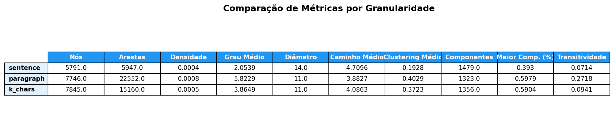
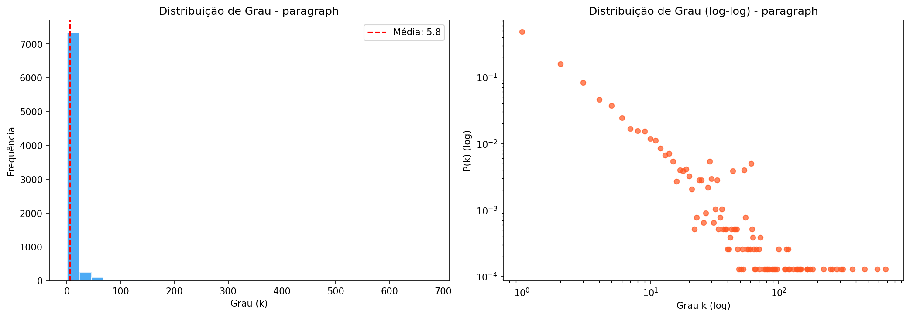
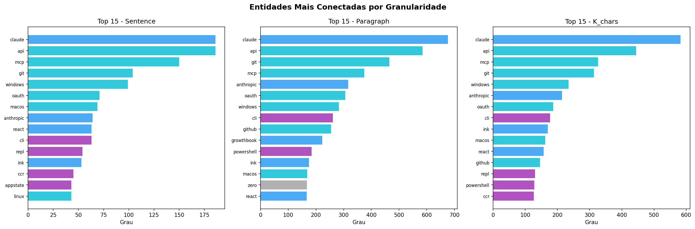
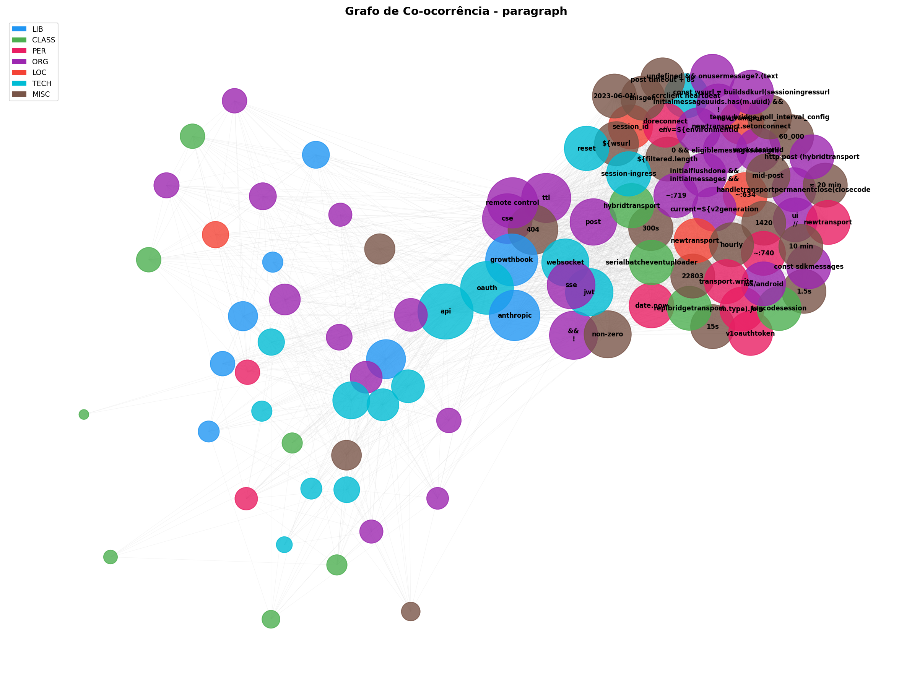

# Relatório 03 — NER com spaCy (en_core_web_lg)

## O que mudou

- Ativado spaCy com modelo `en_core_web_lg` para extrair entidades de
  linguagem natural (PER, ORG, LOC, MISC) além do regex customizado.
- Expandida a stoplist para filtrar ruído introduzido pelo spaCy:
  `função`, `classe`, `first`, `one`, `two`, `max`, `min`, `sdk`, etc.
- Default do `NERPipeline` alterado de `pt_core_news_lg` para `en_core_web_lg`.
- `graph_builder.py` agora roda com spaCy habilitado por padrão.

## Evidência

### Tamanho dos grafos

| Granularidade | Nós (02) | Nós (03) | Arestas (02) | Arestas (03) |
| ------------- | -------- | -------- | ------------ | ------------ |
| Sentença      | 921      | 5.791    | 1.064        | 5.947        |
| Parágrafo     | 1.763    | 7.746    | 4.931        | 22.552       |
| K-chars (500) | 1.756    | 7.845    | 4.163        | 15.160       |

O spaCy aumentou os grafos em ~4x (nós) e ~4-5x (arestas), adicionando
entidades de linguagem natural que o regex não capturava.

### Métricas gerais (parágrafo)

| Métrica                | 02-filtered | 03-spacy |
| ---------------------- | ----------- | -------- |
| Nós                    | 1.763       | 7.746    |
| Arestas                | 4.931       | 22.552   |
| Densidade              | 0,0032      | 0,0008   |
| Grau médio             | 5,59        | 5,82     |
| Grau máximo            | 156         | 677      |
| Componentes conectados | 166         | 1.323    |
| Maior componente (%)   | 74,9%       | 59,8%    |
| Diâmetro               | 12          | 11       |
| Caminho médio          | 4,16        | 3,88     |
| Clustering médio       | 0,4864      | 0,4029   |
| Transitividade         | 0,3910      | 0,2718   |

### Top 10 entidades por grau (parágrafo)

| Entidade   | Tipo | Grau |
| ---------- | ---- | ---- |
| claude     | LIB  | 677  |
| api        | TECH | 585  |
| git        | TECH | 465  |
| mcp        | TECH | 374  |
| anthropic  | LIB  | 316  |
| oauth      | TECH | 306  |
| windows    | TECH | 283  |
| cli        | ORG  | 261  |
| github     | TECH | 254  |
| growthbook | LIB  | 223  |

## Análise

### Impacto do spaCy

- O número de entidades únicas cresceu ~4x, confirmando que o spaCy captura
  informação que o regex puro não alcança (nomes próprios, organizações,
  termos técnicos em linguagem natural nos comentários).
- A densidade caiu (0,0032 → 0,0008) porque os novos nós são mais esparsos —
  entidades de linguagem natural co-ocorrem menos entre si que entidades de
  código.

### Estrutura da rede

- O maior componente encolheu proporcionalmente (75% → 60%) porque as novas
  entidades do spaCy formam muitos pequenos clusters isolados.
- Clustering médio caiu (0,49 → 0,40) — as entidades do spaCy são menos
  agrupadas que as de código.
- Apesar disso, o diâmetro diminuiu (12 → 11) e o caminho médio encurtou
  (4,16 → 3,88), sugerindo que os hubs centrais ficaram mais conectados.

### Entidades centrais

- **`claude`** consolidou-se como hub principal (grau 677, 4x mais que antes).
- **`cli`** aparece como nova entidade relevante (ORG, grau 261) — detectada
  pelo spaCy em comentários referenciando "CLI".
- **`growthbook`** ganhou destaque (grau 223) — ferramenta de feature flags
  usada no Claude Code.
- **`oauth`** e **`windows`** subiram no ranking, refletindo os subsistemas
  de autenticação e compatibilidade cross-platform.

## Limitações

### Ruído residual

- `cli` classificado como ORG pelo spaCy — deveria ser TECH ou MISC.
- Algumas entidades curtas do spaCy podem ser falsos positivos (e.g., siglas
  de 3 letras).
- A stoplist expandida filtrou os piores casos (`função`, `first`, `one`,
  `max`, `sdk`).

## Próximos passos

- Detecção de comunidades (Louvain) para identificar clusters temáticos.
- Visualização interativa com pyvis.
